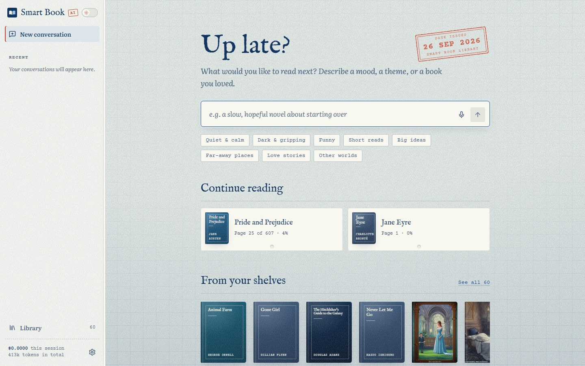
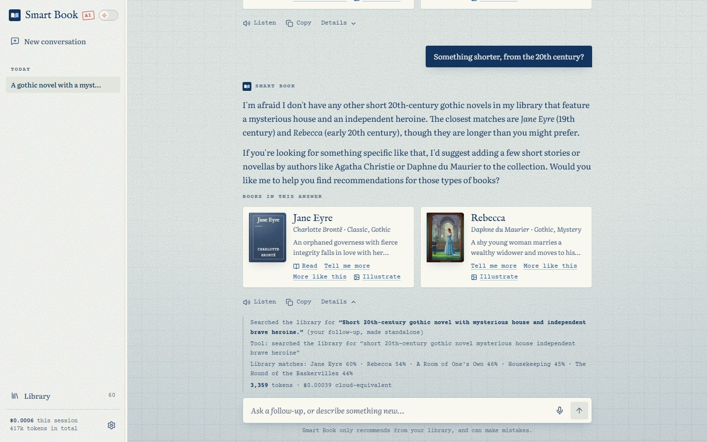
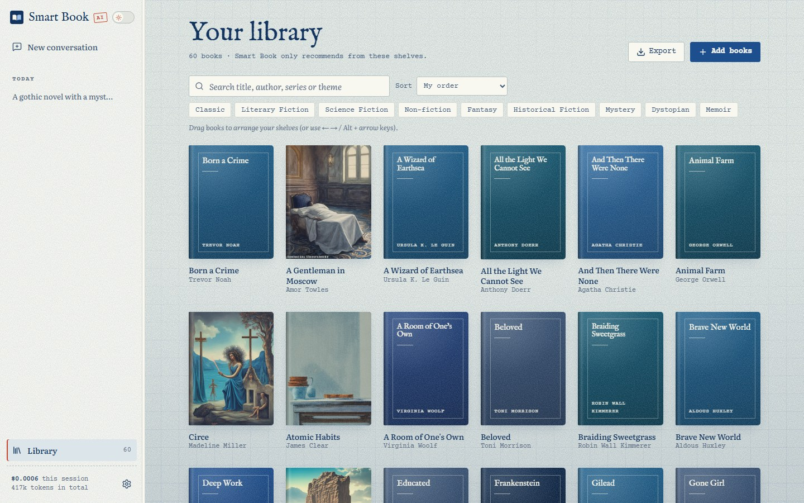
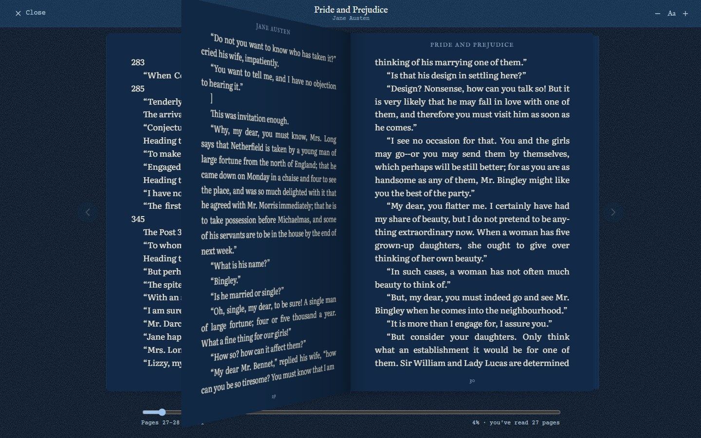
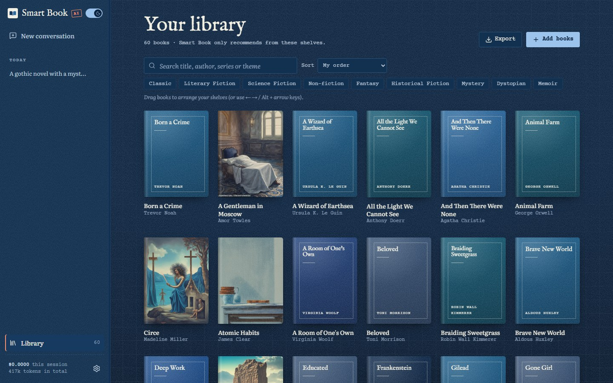
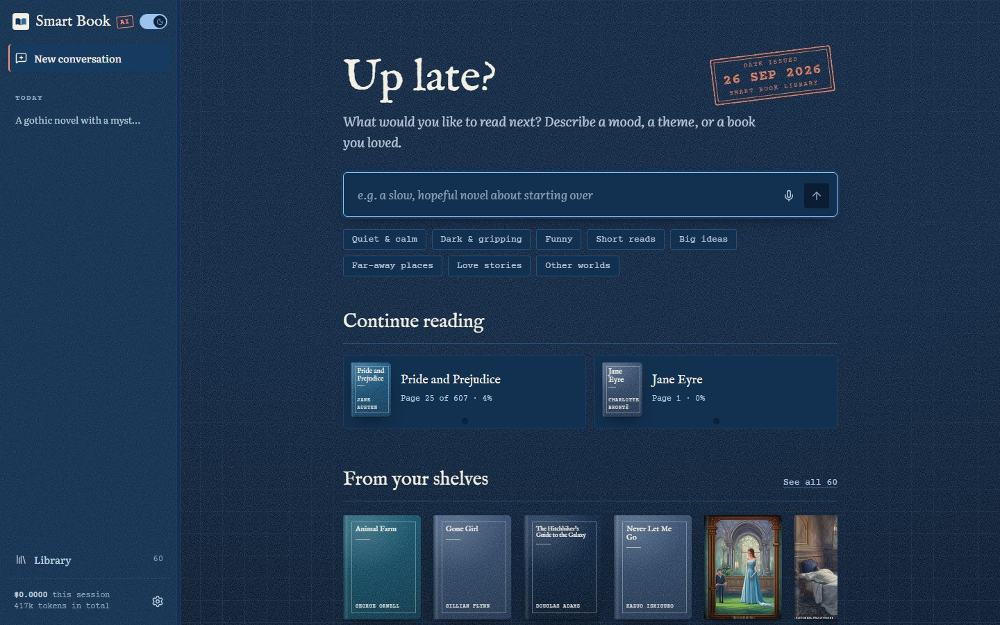
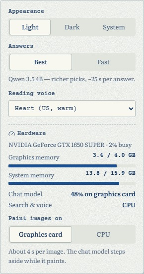
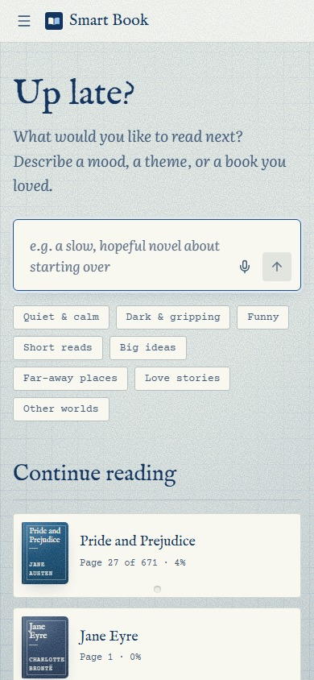
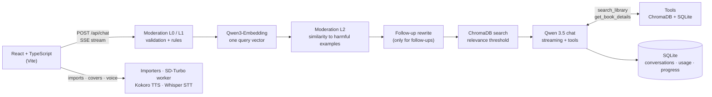

#  Smart Book AI

[](https://www.python.org/)
[](https://www.starlette.io/)
[](https://ollama.com/)
[](https://www.trychroma.com/)
[](https://www.sqlite.org/)
[](https://huggingface.co/stabilityai/sd-turbo)
[](https://react.dev/)
[](https://www.typescriptlang.org/)
[](https://vite.dev/)
[](#tests)
[](#design-decisions)

**A local AI librarian that recommends English books from your own library.** Describe a mood,
a theme or a book you loved, and Smart Book AI searches your shelves and answers with books
you actually own. It explains each pick, and you can open the book and read it in the app.

It is a full retrieval-augmented generation (RAG) stack: Qwen embeddings, semantic search in
ChromaDB with a relevance threshold, follow-up questions rewritten into standalone searches,
function calling, and layered moderation before any model call. Everything runs on a
mid-range PC through Ollama, sized for a 4 GB graphics card. The chat model, embeddings, cover
painting and voice all run locally, with no API keys, and no book or message leaves the machine.



## Highlights

- **Answers grounded in your library.** Every book is embedded with Qwen3-Embedding and stored
  in ChromaDB. A request only reaches the chat model together with the books that pass a
  calibrated relevance threshold. When nothing fits, Smart Book says so rather than invent a title.
- **Conversation-aware follow-ups.** "Something shorter, from the 20th century?" is rewritten into a
  standalone library search using the conversation so far. The rewritten query is shown under
  the answer.
- **Function calling.** The chat model can call `search_library` and `get_book_details` against the
  vector database, for up to three tool rounds. The last round must answer in text.
- **Layered moderation before any model call.** L0 input validation, then L1 rules (prompt
  injection, dangerous how-tos, hate, and self-harm answered with crisis resources), then L2
  embedding similarity to harmful examples. L2 reuses the query's retrieval embedding, so
  moderation adds no extra model call.
- **Streaming answers with book cards.** Server-sent events report each stage (moderating →
  rewriting → searching → generating) and stream the tokens. Each recommended book gets a card with its
  cover and quick actions.
- **Token and cost accounting.** Every embedding, rewrite, chat and tool round is recorded per
  session and per conversation. Tokens are priced at configurable cloud-equivalent rates, and a
  gauge shows how full the context window is.
- **Import almost any book.** PDF, Word, EPUB, Markdown, text or a JSON list, one book or a whole
  series at once, up to 200 MB per file. A progress window shows a live percentage, and Cancel
  works at any point, keeping nothing half-indexed.
- **A reader in the app.** Two-page spread with a 3D page turn and adjustable text size, and it
  reopens exactly where you stopped. Seven public-domain classics ship with their full text.
- **Series and shelves.** Group books into series with % read per book, and drag books into your
  own order, with animated reordering and keyboard shortcuts.
- **Local generative media.** SD-Turbo paints covers and scene illustrations on the GPU in about
  3.5 s. You can also upload your own cover. Answers can be read aloud with Kokoro TTS, and
  questions dictated with Whisper STT.
- **Hardware-aware.** A Hardware panel shows live VRAM and RAM, how much of the chat model is on the
  graphics card, and where images are painted.

## Screenshots

| Grounded answers, follow-up rewriting and the Details panel | Your library |
|---|---|
|  |  |

| Reader with a 3D page turn (night) | Book details |
|---|---|
|  |  |

| Night mode: library | Night mode: home |
|---|---|
|  |  |

| Settings and hardware panel | Phone layout |
|---|---|
|  |  |

## Tech stack

| Layer | Technologies |
|-------|--------------|
| Frontend | React 19, TypeScript 6, Vite 8, react-markdown, lucide-react, hand-written CSS (no UI kit), native HTML5 drag and drop with FLIP animations |
| Backend | Python 3.12, Starlette, Uvicorn, server-sent events, httpx |
| Language models | Ollama: Qwen 3.5 4B (answers and tools), Qwen 3.5 2B (fast mode), Qwen3-Embedding 0.6B |
| Retrieval and storage | ChromaDB (persistent, cosine), SQLite (books, conversations, usage, reading progress) |
| Media | PyTorch (CUDA) + diffusers (SD-Turbo), kokoro-onnx (TTS), faster-whisper (STT), Pillow |
| Import | pypdf, python-docx, EPUB via zipfile + HTMLParser, Markdown/JSON parsers |
| Quality | pytest (111 tests, fake LLM), Playwright (23 browser tests), oxlint, TypeScript type-check |

## Architecture



- **The chat pipeline** (`chat.py`) streams events to the browser: `meta`, `status`, `rewrite`,
  `sources`, `tool`, `token`, `blocked`, `done` and `error`.
- **Indexing:** each book gets a summary card, made from its title, author, series, genres, themes
  and description, plus passages from its full text: 1,200 characters with a 200-character
  overlap, up to 1,000 per book. Queries get Qwen3's retrieval instruction prefix. Results are
  deduplicated per book, and at most five books go into the prompt.
- **Long jobs** (imports, re-indexing) carry an `X-Job-Id`. The browser polls
  `/api/jobs/{id}` for a percentage and can cancel through `/api/jobs/{id}/cancel`. A cancelled
  import rolls back, so nothing half-indexed stays in the library.
- **The image model runs in its own worker process,** so its memory is fully released when it
  exits.
- **In production,** Starlette serves the built frontend and the API from a single port.

## Design decisions

- **Sized for a 4 GB graphics card.**
  - `qwen3.5:4b` is the default: about 48% of it sits on the GPU and it answers at ~10 tokens/s.
  - `qwen3.5:2b` fits entirely on the GPU (~78 tokens/s) and powers Fast mode.
  - `qwen3.5:9b` was rejected, because at 6.6 GB it would run mostly on the CPU.

  All measurements are in [`chunks/02-hardware-and-models.md`](chunks/02-hardware-and-models.md).
- **Query embeddings stay off the GPU.** A query embeds on the CPU in about 60 ms, which leaves
  the VRAM to the chat model. Whole-book indexing switches the embedder to the GPU and asks
  Ollama to unload the chat model first.
- **One embedding, two jobs.** The same query vector feeds L2 moderation and retrieval.
- **Say "no match" instead of inventing one.** The relevance threshold (0.68 cosine distance) was
  calibrated on real queries. The system prompt only allows books from the retrieved context or
  from tool results. When nothing passes, the model is told so and may search again with
  different words.
- **A throw-away process for the image model.** PyTorch doesn't return memory to the OS, so
  SD-Turbo runs in a worker that is released before every chat turn and after 90 s idle.
  GTX 16xx cards produce black images in fp16. The fix disables cuDNN for the UNet and runs the
  VAE in fp32: a cover takes 3.4–3.9 s with ~2.8 GB of RAM, instead of 18–20 s and 6.3 GB on the CPU.
- **Reading position as a character offset.** Pages are laid out in the browser, so a new font,
  text size or window size keeps your place. Only the page numbers change.
- **Only clean images are served.** Uploaded covers are decoded, resized and re-encoded to WebP.
  The original file is never served.
- **Tests without a GPU.** A fake LLM, with hashed bag-of-words embeddings and scripted answers,
  lets all backend and browser tests run without Ollama.

## Getting started

Requirements: **Python 3.12+** with [uv](https://docs.astral.sh/uv/), **Node.js 20.19+**,
[Ollama](https://ollama.com/), and optionally an NVIDIA GPU (4 GB is enough). Developed and tested
on Windows 11.

### 1. Language models (once)

```bash
ollama pull qwen3.5:4b
```

```bash
ollama pull qwen3.5:2b-q4_K_M
```

```bash
ollama pull qwen3-embedding:0.6b
```

### 2. Image and speech models (once, about 3 GB)

```bash
uv run --project backend python -m smartbook.media download
```

### 3. Frontend packages

```bash
npm --prefix frontend install
```

### 4. Run

| Script | What it does |
|--------|--------------|
| `./start.sh` | Starts Ollama if it isn't running, the API on :8000 and the Vite UI on :5173 with hot reload. Reuses anything already running; Ctrl+C stops only what it started |

On Windows, run it from Git Bash. Then open http://127.0.0.1:5173.

To serve everything from one port instead, build the interface once and start the API:

```bash
npm --prefix frontend run build
```

```bash
uv run --project backend smartbook
```

Then open http://127.0.0.1:8000. On first start, the library is seeded with 60 English books,
and the full text of 7 public-domain classics is attached.

Optional Ollama tuning for small GPUs: `OLLAMA_FLASH_ATTENTION=1` and `OLLAMA_KV_CACHE_TYPE=q8_0`.

## Configuration

Copy `backend/.env.example` to `backend/.env`. The main settings:

| Variable | Default | Meaning |
|----------|---------|---------|
| `SMARTBOOK_MODEL_PRO` / `_LITE` / `_EMBED` | `qwen3.5:4b` / `qwen3.5:2b-q4_K_M` / `qwen3-embedding:0.6b` | Models for Best answers, Fast answers and embeddings |
| `SMARTBOOK_RELEVANCE_MAX_DISTANCE` | `0.68` | Cosine distance a book must beat to be recommended |
| `SMARTBOOK_MODERATION_THRESHOLD` | `0.60` | Similarity to harmful examples that blocks a message |
| `SMARTBOOK_TOP_K` / `SMARTBOOK_MAX_BOOKS` | `12` / `5` | Passages retrieved / books put in the prompt |
| `SMARTBOOK_NUM_CTX` | `8192` | Context window requested from Ollama |
| `SMARTBOOK_EMBED_ON_CPU` | `1` | Keep query embeddings on the CPU so the chat model keeps the GPU |
| `SMARTBOOK_MAX_UPLOAD_MB` | `200` | Largest file you can import |
| `SMARTBOOK_PRICE_*` | e.g. `0.10` / `0.40` | Cloud-equivalent $ per 1M input / output tokens, for the usage view |

## Tests

```bash
cd backend && uv run pytest
```

```bash
cd frontend && npx playwright test
```

```bash
cd frontend && npm run lint && npx tsc -b
```

**111 backend tests** run against a fake LLM, so they need no Ollama and no GPU. They cover:
- moderation layers and follow-up rewriting
- chunking, retrieval and the relevance threshold
- every importer (PDF, DOCX, EPUB, Markdown, JSON), upload limits and import progress
- the HTTP API, including cancelling jobs and saving the shelf order
- series and reading progress
- media endpoints: painted and uploaded covers, speech

**23 Playwright browser tests** start their own isolated backend and UI on ports 8001 and 5174.
They cover:
- grounded answers with book cards, and follow-ups rewritten from the conversation
- moderation blocking a prompt injection before any model call
- importing books and whole series, with real drag-and-drop ordering and cancelling
- the reader turning pages and reopening where you left off
- painting covers and illustrations, listening to answers, dictation
- day and night mode, confirmations before deleting, editing details
- your own shelf order, uploading a cover, and the page count

## API

| Method | Path | Purpose |
|--------|------|---------|
| POST | `/api/chat` | Ask a question. Streams the answer as server-sent events |
| GET / POST / PATCH / DELETE | `/api/books`, `/api/books/{id}` | List, add, edit and remove books |
| POST | `/api/import/preview`, `/api/books/bulk` | Read uploaded files into drafts, then add many books at once |
| POST | `/api/books/{id}/text`, `/api/books/{id}/reindex` | Attach a book's full text, or index it again |
| GET / PUT | `/api/books/{id}/content`, `/api/books/{id}/progress` | Text for the reader, and your saved place |
| POST / PUT | `/api/books/{id}/cover` | Paint a cover with SD-Turbo, or upload your own |
| POST | `/api/books/{id}/illustrate` | Paint a scene from a recommended book |
| PUT | `/api/books/order` | Save your own shelf order |
| GET / POST | `/api/jobs/{id}`, `/api/jobs/{id}/cancel` | Progress and cancelling for long imports |
| GET | `/api/conversations`, `/api/usage` | Chat history, and tokens and cost per session |
| GET / POST | `/api/hardware` | GPU and memory status; where images are painted |
| POST | `/api/tts`, `/api/stt` | Read an answer aloud, or transcribe a spoken question |

<details>
<summary>Example chat stream</summary>

```text
event: meta      data: {"conversation_id": "…", "title": "A gothic novel with a mysterious old house…"}
event: status    data: {"stage": "moderating"}
event: status    data: {"stage": "rewriting"}
event: rewrite   data: {"query": "Short 20th-century gothic novel with mysterious house and independent brave heroine."}
event: status    data: {"stage": "searching"}
event: sources   data: {"books": [{"title": "Jane Eyre", "author": "Charlotte Brontë", "score": 0.60, …}, …]}
event: status    data: {"stage": "generating"}
event: tool      data: {"name": "search_library", "args": {"query": "short 20th-century gothic novel mysterious house …"}}
event: token     data: {"text": "I'm afraid "}
…
event: done      data: {"message_id": "…", "cited": ["…"], "usage": {"prompt_tokens": …, "completion_tokens": …, "cost": 0.00039},
                        "context": {"used": …, "max": 8192}}
```
</details>

## Project structure

```
backend/
  src/smartbook/
    app.py          Starlette routes, SSE, background jobs, static UI
    chat.py         RAG pipeline: moderation → rewrite → retrieve → chat with tools
    library.py      ChromaDB indexing, chunking, embeddings, search
    moderation.py   L1 rules and L2 semantic moderation
    rewrite.py      Follow-up detection and standalone-query prompt
    llm.py          Ollama client (chat, tools, embeddings, VRAM control) and a fake LLM for tests
    importers.py    PDF, DOCX, EPUB, Markdown, TXT and JSON import
    media.py        SD-Turbo worker, cover uploads, Kokoro TTS, Whisper STT
    db.py           SQLite store: books, conversations, usage, reading progress
    config.py       Settings from environment variables
    seed.py, classics.py   Seed library and public-domain full texts
  seed/             60 seed books + 7 classic texts
  tests/            pytest suite
frontend/
  src/
    App.tsx         App state, chat stream, library actions
    components/     Home, chat messages, library, series, reader, dialogs, drawer
    lib/            Pagination, drag-to-reorder hook, speech, preferences
    api.ts          Typed API client with an SSE reader
    index.css       Design tokens and components; reader.css for the reader
  e2e/              Playwright tests
docs/screenshots/
chunks/             Project notes: brief, hardware and models, design system, architecture, API, progress log
start.sh            Starts Ollama, the API and the UI for development
```

## Limitations

- **English only.** The prompts, moderation rules and seed library are written for English books.
- **Recommends only what you own.** This is by design. Books outside your library are mentioned
  only as suggestions to add.
- **Speed follows your hardware.** On a GTX 1650 SUPER, a Best answer takes about 25 s. Fast mode
  is several times quicker.
- **Voice runs on the CPU.** Kokoro and Whisper stay on the CPU, because the bundled CUDA 13
  PyTorch and faster-whisper's CUDA 12 runtime don't mix.
- **Page counts are estimates.** Pages depend on font and window size, so the book details show
  "about N pages".
- **Built and tested on Windows 11.** The Python and web code is cross-platform, but the GPU paths
  were only measured on one machine.

---

Built by [Catalin](https://github.com/CataBulu).
